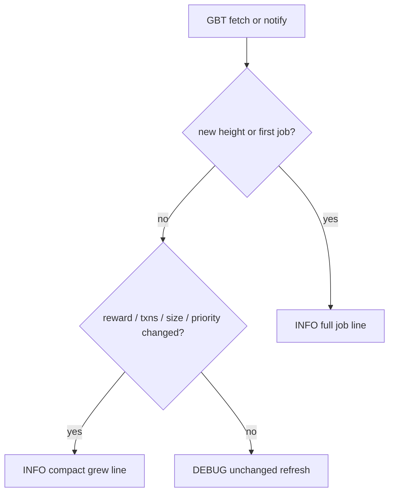
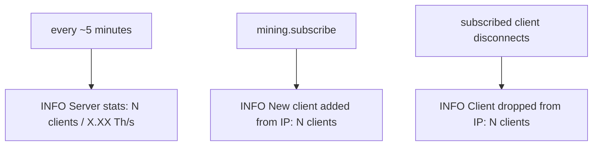

# Logging strategy

DATUM Gateway logs **state transitions**, not periodic ticks.

The default console level is already INFO (`logger.log_level_console` = `2`). Do not raise the process to WARN to hide noise. Most chatter was INFO *ticks*: job refresh every `bitcoind.work_update_seconds` (default 40s), notify bursts, and idle heartbeats.

Comparisons use **structured fields** (height, satoshis, txn count, size, subscriber count), not formatted strings, so float printing cannot hide a real change.

There is no global last-line `strcmp` filter in the logger. That would race across threads and can hide real events. Each hot path keeps its own snapshot.

## Levels

Configured independently for console and file:

| Value | Name  | Typical use |
|------:|-------|-------------|
| 0     | All   | Everything, including logger internals |
| 1     | Debug | Unchanged refreshes, pacing, share accept/reject, HTTP/JSON-RPC chatter |
| 2     | Info  | Operator-visible transitions (default console) |
| 3     | Warn  | Recoverable problems operators should notice |
| 4     | Error | Failures that need action |
| 5     | Fatal | Init/panic; process will exit |

Defaults: console INFO (`2`), file DEBUG (`1`) when a log file is enabled.

- **INFO**: new height, first job of a height (even with 0 clients), mempool actually grew, real client send, subscriber add/drop, 5-minute stats, listen/config/keys, successful block submit
- **DEBUG**: same-template refresh, empty-client send completion, per-tick countdown, blast/pacing internals, TCP connect/close before subscribe, share accept/reject, HTTP/JSON-RPC chatter
- **WARN**: send/reject failures, stalled templates, duplicate notifications that **disagree**, pooled-only disconnect, file-limit notes, BLOCK FOUND banner
- **ERROR / FATAL**: init, parse, OOM, panic, crypto, and submit-path failures (unchanged)

## Job updates

Template fetches and notifies decide the job line as follows:

Implemented in `src/datum_blocktemplates.c` via a file-static snapshot (`job_log_state_t`) and `log_stratum_job_update()`.

- **New height or first emit**: full INFO. Example: `Updating priority stratum job for block N: X.XXXXXXXX BTC, T txns, B bytes (Sent to C stratum clients)`
- **Same height, fields changed**: compact INFO: `block N job +T txns (+B B), reward +X.XXXXXXXX BTC` (with a `priority`/`standard` prefix if that flipped)
- **Unchanged**: `Job refresh unchanged for block N (C clients)` at DEBUG
- The snapshot is updated only on INFO, so a later growth line is the delta since the last operator-visible job, not since the last silent refresh

A DATUM reconnect (`notify_othercause`) forces a priority job. That is a real transition: INFO if height or fields (including priority) changed.

Do not throttle all job logs blindly, and do not drop the first job of a height.

## Block notifications

`NEW NETWORK BLOCK: <prevhash> (<height>)` stays INFO when the previous-block hash actually changed.

`NEW NETWORK BLOCK NOTIFICATION RECEIVED` can fire twice per height (node `blocknotify` plus the fallback `getbestblockhash` poller). A latch on last hash/height/timestamp decides:

- Same hash (or a hash-less signal) within ~500 ms, or the hash is already applied to the current template: DEBUG
- New hash: INFO, including hash/height when `datum_blocktemplates_notifynew` provided them
- Same height, **different** hash after a template is already applied: WARN (disagree)

Existing DEBUG paths for multi-notified / duplicate signal / testnet fast-forward stay DEBUG. Stalled notify after 16 attempts stays WARN.

## Clients and the 5-minute ticker

Subscriber count is the same figure used by the dashboard-style stats line (`datum_stratum_v1_global_subscriber_count()`).

- **Every ~5 minutes**: `Server stats: N client(s) / X.XX Th/s` at INFO, even if idle `0 / 0.00`
- **New subscriber**: `New client added from <ip> (<useragent>): N clients` immediately after `mining.subscribe` (useragent omitted if empty). TCP accept before subscribe remains DEBUG
- **Subscriber drop**: `Client dropped from <ip> (<useragent>): N clients` immediately when a subscribed client disconnects. The count is taken after the drop. Unsubscribed TCP closes remain DEBUG

Empty-work send completion is INFO only if at least one client was sent; otherwise DEBUG.

## Other repetitive paths

These used to tick at INFO/WARN on a timer or every job. They now latch on state:

| Event | First / transition | While unchanged |
|-------|--------------------|-----------------|
| Waiting on DATUM server | One INFO: `Waiting up to 15s for DATUM server` | DEBUG per-second countdown; ERROR if it fails |
| GBT fetch down | First failure ERROR | Repeats DEBUG; ERROR again every 30s; INFO once when fetch recovers |
| Max-clients reject | First reject INFO | Then `Rejecting connection (N since last noted)` on a 5s batch (same pattern as pooled-only rejects) |
| Coinbaser NULL / too short | WARN once per empty stretch | DEBUG while still empty; WARN again only after it recovers then fails |

API disabled is logged once from `datum_api_init` (`No API port configured. API disabled.`). The thread path does not repeat it.

## What stays at its original level

- **INFO**: Stratum/API listen, keys, MOTD, pool messages, config write/restart, block submit success, disconnect-all
- **WARN**: BLOCK FOUND banner, upstream reject, pooled-only shutdown, rlimit notes, handshake key mismatch, Safari digest-auth, API admin disconnects
- **DEBUG**: blast/pacing, GBT field dumps, share accept/reject, JSON-RPC HTTP fail, CSRF/password miss
- **FATAL/ERROR**: all init/OOM/parse/crypto/submit-path failures

No new logger API and no extra config knobs for this policy.

## Expected idle console (INFO)

Per new height:

1. One notify (if the hash is new)
2. `NEW NETWORK BLOCK`
3. One priority job INFO (empty or full)
4. Further job INFO only when txns/fees/size grow

Meanwhile:

- A DEBUG job refresh every ~40s (visible in the file if `logger.log_level_file` is `1` or lower)
- `Server stats` every ~5 minutes
- `New client added` / `Client dropped` immediately when the subscriber set changes
